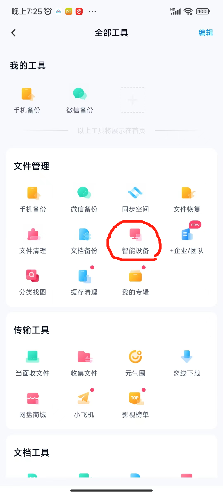

# mytrs
## 一些tips

### 1.如何从github上下载内容
发现有些人不知道怎么从github下载东西，github上所有的发布内容都集中在release里面，从图示位置进入。

### 2.关于防止翻译数据丢失

首先，在正常的已发布版本中，我从未遇到保存失败的情况；其次，工具内已经做好了充足的防范措施，如果真的保存失败，会将所有数据原封不动的保存在Excel文件中。手动处理后就能继续使用。再次，如果对本工具实在不放心，请打开百度翻译的自动备份功能。具体方法为，打开百度翻译控制台，拉到图示位置，打开自动备份功能。

打开后，所有的翻译数据会每隔几个小时自动上传云端，可以在百度云app的“全部工具”→“智能设备”中查看。

这些数据同样通过手动处理后即可使用。任何人使用本工具过程中，遇到了需要手动处理数据的情况，都可以把这些数据发给我，在我有心情有时间的情况下，可以帮你们处理一下。

再此基础上，如果你还是无法信用本工具，请不要使用。

### 3.你们使用本工具，我本人无法从中获取任何利益。

使用过程中遇到任何问题、bug，欢迎联系我，但是态度好点，我不欠你们的。

mytrs为用于搭配mtool来机翻RPGMaker等引擎制作的游戏的工具，可用于翻译任意符合格式要求的文本文件。特点是翻译速度快，~~测试不足，bug多~~
## 工具功能介绍
本工具目前支持百度、彩云、小牛三种翻译引擎，支持的文件格式为json格式：

    {
        "原文1":"原文1（翻译后对应译文）",
        "原文2":"原文2",
        ...,
        "原文n":"原文n"
    }

工具会自动识别文件名称为ManualTransFile.json的文件进行翻译，并将翻译结果以json格式保存为TrsData.bin中。系统配置储存在配置文件config.json中，用户需自行设置。

以行为单位，当源语言为非英文时，能自动剔除文本中仅含英文和特殊符号的字符串，以节省翻译引擎流量。特殊符号的范围可在配置文件中自行删改。

能自动记录利用本工具所消耗的字符量流量（usage），并在每月初流量重置时重置所记录的usage。当usage接近上限（limits）时自动停止翻译并分别导出翻译结果和未翻译部分。

当配置文件中包含多个翻译引擎时，自动按顺序使用这些翻译引擎，并分别记录usage。

翻译时可按字符串长短排序，按从长到短的顺序进行翻译，以便优先使用效果好的翻译引擎翻译较长（通常也是较为重要）的文本。

支持本地字词库，实现原理是在翻译前以字词库中对应的译文替换原文中相应的部分，并在翻译后将原文复原，~~经过测试，效果极差~~,字词库与ManualTransFile.json使用相同的格式，且存在先后顺序，从上到下依次进行替换。目前不支持多个原文对应同一译文，会导致复原原文时出现错误。

## 使用方法：
确保在同一目录下存在config.json和ManualTransFile.json，如果要使用字词库，确保字词库也在此目录，然后运行mytrs.py或mytrs.exe即可，运行py文件须确保已安装所需的库。配置文件说明详见压缩包内“必看！！使用说明.txt”文件

翻译结果会自动保存在TrsData.bin内，如果存在翻译失败的文本，会保存在error.json内。如果翻译引擎报错，会自动停止使用此引擎，并切换到下一个引擎。若当前流量不足以完整此翻译文件，会将已翻译的部分保存为TrsData.bin，未翻译部分保存为untrsed.json。如果文件保存失败，会将数据以原本的格式（pandas的DataFrame）保存在对应文件名+_fail.txt内。

如果遇到任何bug、闪退，或非mtool原因的大面积漏翻，请上报于我。
## 更新记录
v1.9.4(2023.5.11):

1.现在文本过长也不会返回空参数了，但是如果超出引擎限制，可能会返回其他错误代码（每次请求的第一行字符串会无视NPQ的限制进行翻译）

v1.9.3（2023.5.10）：

1.现在会输出完整的报错信息了，方便各位上报bug，也方便我筛查问题所在

v1.9.2（2023.5.7）：

1.修复了会遍历整个enginelist，重复翻译的问题

v1.9.1（2023.5.7）:

1.更新了百度api的请求网址

v1.9（2023.4.24）:

1.config添加一项"cleaner"，用于开关cleaner功能，0关闭，1开启。对于英文翻译，不能使用cleaner功能，用了的话会把英文文本全部删除，以前没注意到。并将进行判断的特殊字符放在了config的"special"中，可自行删改;

2.优化了每次请求中字符量（NPQ）的判断，现在每次请求一定不会超过NPQ了，同时对limits的判断也更为精确，实际消耗会控制在limits-NPQ左右;

3.修正了在1.7和1.8更新后发现的bug。

v1.8（2023.4.24）:

1.现在在翻译前会先依照文本长短进行排序，优先翻译长文本，因为长文本大概率是剧情文本，这样在翻译引擎字数不足时，这些文本会被优先翻译。

在这种情况下，推荐将翻译效果好的引擎放在enginelist的前面，一种进阶玩法是，手动调整limits的大小，达到用效果比较好的翻译引擎将大部分剧情文本
翻译后，用效果差的翻译引擎去翻译那些不重要的文本。（怎么可能有人能靠手动设置做到这个-_-,用代码比较好的实现这个效果的方法我也没想到，以后再说吧）
（其实这个功能是想用在chatgpt上的，奈何gpt没有免费额度，只能作罢。）

v1.7（2023.4.24）:

1.更换了分隔每行字符的分隔符（从“S/som”换成了“↑☆↓☆”），消除了可能的对英文翻译的影响；

2.现在能够自动记录api通过本工具消耗的总字符量，并且每月初自动重置；

3.删除了config.json中‘engine’项，改为按‘enginelist’中的先后顺序，按顺序使用翻译引擎，当前一个引擎字数达到上限后，自动更换到下一个引擎
若所有引擎的总余量仍不足以翻译整个文件，则会在翻译前提示，并在翻译后将已翻译部分和未翻译部分分别保存在TrsData.bin和untrsed.json中，
配置文件config.json的说明已在“必看！！使用说明.txt”中更新。

v1.6:

1.大概率修正了彩云吞换行符的问题。

v1.5：

1.因为百度翻译存在奇怪的bug且找不到原因，直接修改了整个框架，现在的框架比以前的更合理了;

2.修正了换行符只考虑到\n而没考虑到\r的问题;

3.修正了读取文件失败后闪退的问题（应该停留在报错界面）;

4.修正了字词库替换原文后没有替换回来的问题。
## others
本人非相关专业学生/从业者，如果你看我的代码难受，你自己来。

可考虑接入ChatGpt进行翻译，但因为Gpt api没有免费用户计划，所以目前本人没有接入的计划。
