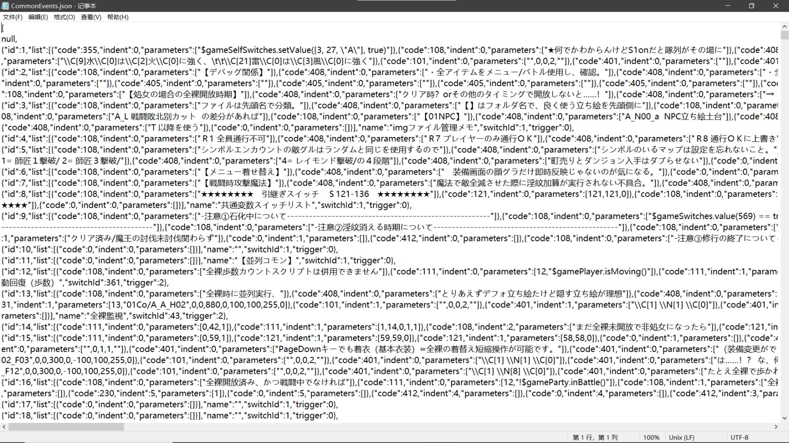
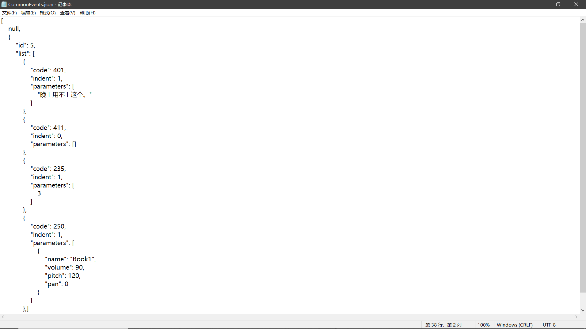

先叠个甲：本人没有学习过任何游戏引擎相关知识，通过拆包可能有更方便的实现方法。

相信各位一定遇到过这种情况，某个汉化游戏的版本要旧于此游戏的最新版本，而由于某种原因，你没有办法入手最新的汉化版本。并且由于汉化文本是内嵌在游戏中的，没有办法利用mtool来提取出汉化文本，并应用在新版游戏上。

本文章所提出的方法，便是为了解决这种窘境而诞生的。基本思路就是想办法从已汉化的旧版游戏中提取出游戏文本，替换到新版游戏当中，然后利用mtool和untrsfix，将剩余未汉化文本提取，并翻译。不过可惜的是，目前我只找到了适用于一小部分引擎的方法。

这一小部分引擎指的是，游戏文件夹内含有‘data’文件夹，并且data文件夹内全部都是json文件的引擎。具体来说，大概是这几个引擎（我没有一个个对比去看，但我想translator++把它们放在一起，应该就是因为它们是一个类别的吧。）

#原理及方法
首先打开游戏的data文件夹，我们会看到这几类文件

经过我的初步观察，它们应该分别对应：角色、动画、护甲、角色职业、通用活动（通常是cg）、敌人、道具、地图、地图信息、技能、角色状态（debuff，buff）、系统、？、战斗内信息（包含了战斗内对话内容）和武器。

其中比较重要的是CommonEvents，MapXXX（编号，通常会有很多个）和Troops文件，分别包含了cg文本，各个地图内的剧情文本和战斗内文本。

随意打开一个文件，我们会看到这种玩意

很难从中提取到任何信息，但它是一个json文件，只需要简单整理一下就能从中提取出剧情文本。整理之后，以CommonEvents为例，具有这种格式

如果用python来读取这个文件的话，那么他就是一个list内包含在多个dict的数据形式。其中"parameters"包含了包括文本数据在内的很多数据。那么我们就可以利用除文本数据以外的所有数据作为索引，去找到新版游戏中对应这句译文的原文，然后将它替换成已知的原文。

不同文件内的数据格式都稍有区别，但都可以用相同的方法提取到原文对应的译文。所以我们要做的就是，遍历已汉化旧版游戏，和未汉化新版游戏的data文件夹，将新版游戏内的所有能够与旧版游戏对应上的文本数据做替换。

替换完成后，我们就得到了一份包含有旧版大部分已汉化文本的新版游戏，接下来我们需要做的，便是将新版本新增文本用机翻补全：利用mtool将新旧两个版本的“待翻译文件”提取出来，把旧版本的待翻译文件改名为TrsData.bin，然后利用我做的untrsfix，就可以提取出新版游戏新增的文本了，之后就是常规的机翻，导入翻译文件了。
